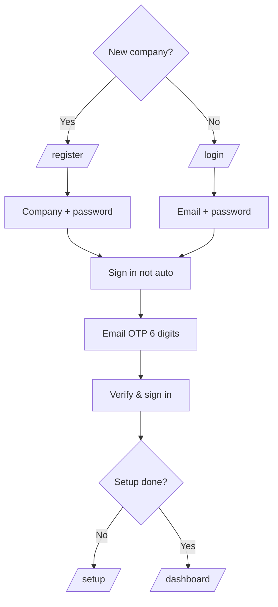

# Platform: Register and sign in

**Where:** https://platform.phantixlabs.com  
**You need:** Work email you control  

---

## Process flow

---

## Register (new organization)

1. Open **Register your organization** (`/register`).
2. Enter company name, primary contact email, password, country/industry as prompted.
3. Submit. You are **not** kept logged in automatically.
4. Go to **Sign in** with the **primary email** and password.
5. Complete **email OTP** when asked.

## Sign in (returning)

1. Open https://platform.phantixlabs.com/login  
2. **Company email** + **password** → **Continue**  
3. Enter the **login / verification code** from email → **Verify & sign in**  
4. If code missing: **Resend code**, wait ~30s, check spam  

---

## After login

| Destination | When |
|-------------|------|
| `/setup` | Setup not finished |
| `/dashboard` | Tenant ready for admin tasks |

---

## Troubleshooting

| Symptom | Action |
|---------|--------|
| Incorrect email or password | Reset password link on login page |
| Rate limit | Wait 1 minute; avoid rapid retries |
| No OTP | Confirm primary email; resend; lab IMAP if testing |
