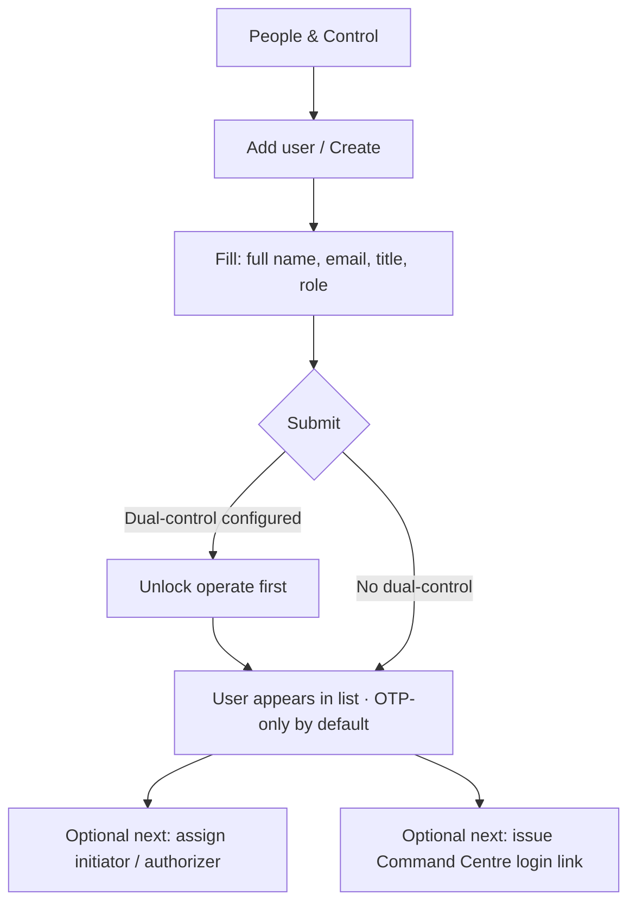

# Platform: Add a new user

**Where:** **People & Control** → `/users`  
**Who:** Company admin (operate / dual-control may be required after bootstrap)

---

## Process flow

---

## Steps

1. Sign in to Platform → **People & Control**.
2. If mutations are blocked, **Unlock operate** (initiator or authorizer OTP).
3. Click **Add user** / **Create**.
4. Enter:
   - Full name  
   - Work email (receives OTPs / login links)  
   - Title (optional)  
   - Role (e.g. admin / security / viewer — as offered in UI)
5. Save.
6. Confirm the user shows as **active**.
7. Prefer **login links** for Command Centre access rather than sharing the company password.

---

## Notes

- Users are typically **OTP-oriented** for day-to-day access.
- Creating users after dual-control bootstrap often needs an active dual-control session.
- Do not reuse one password across the whole team; issue per-user app links.

**Related:** [04-assign-dual-control.md](./04-assign-dual-control.md) · [05-issue-app-login-link.md](./05-issue-app-login-link.md)
