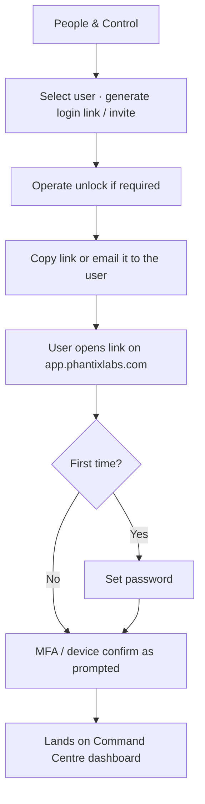

# Platform: Issue a Command Centre login link

**Where:** **People & Control** → user row / login links  
**Result:** Operator opens `app.phantixlabs.com` via secure link (invite or returning login).

---

## Process flow

---

## Steps

1. Platform → **People & Control**.
2. Find the operator.
3. Choose **Issue login link** / **Generate application sign-in link** (wording may vary).
4. Unlock operate if the UI requires it.
5. Copy the URL (or send via your out-of-band channel).
6. Operator opens the link **in their browser** (not shared company password).
7. Complete password (if first time), email OTP, and device binding.
8. Confirm they reach **Command Centre** `/dashboard`.

---

## Tips

- Links may expire; issue a fresh one if login fails.
- Device confirmation protects against token theft on new browsers.
- Lab app password (if using email/password instead of link): see [Command Centre how-tos](../command-centre/).
