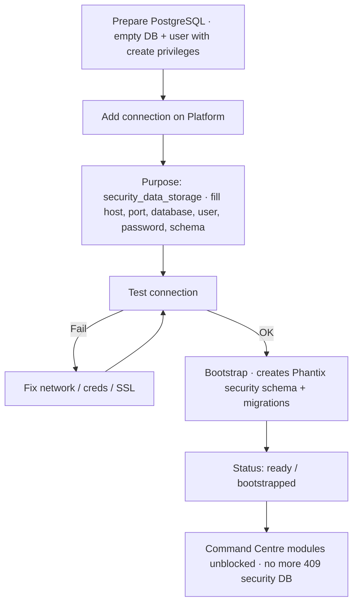

# Platform: Connect a security database

**Where:** **Security Database** → `/connections`  
**Purpose:** Store assets, findings, risks, SOC data in **your** database (privacy-first).  
**Type:** `security_data_storage`

---

## Process flow

---

## Steps

1. Provision a database **you control** (cloud or on-prem PostgreSQL preferred).
2. Platform → **Security Database** (Connections).
3. **Add connection**:
   - **Purpose:** Security data storage (not config inspection)
   - Host, port, database name  
   - Username / password  
   - Schema (or default)  
   - SSL options as required by your host  
4. Click **Test**. Wait for success.
5. Click **Bootstrap** (or “Initialize schema”). Wait until status is **ready**.
6. Optionally mark as **primary**.
7. Open Command Centre and confirm assets/scans no longer show “security DB not ready”.

---

## Requirements

| Item | Notes |
|------|--------|
| Empty or dedicated DB | Do not point at production app OLTP blindly |
| Network path | Platform/backend must reach host:port |
| Privileges | Create schema / tables for bootstrap |
| One primary | Prefer a single primary security store per org |

---

## Troubleshooting

| Error | Action |
|-------|--------|
| Test timeout | Firewall / security group / wrong host |
| Auth failed | User/password; scram vs md5 |
| Bootstrap failed | Check privileges; read last error on connection card |
| 409 in app | Bootstrap not finished or not primary |

**Related:** [07-connect-config-database.md](./07-connect-config-database.md)
