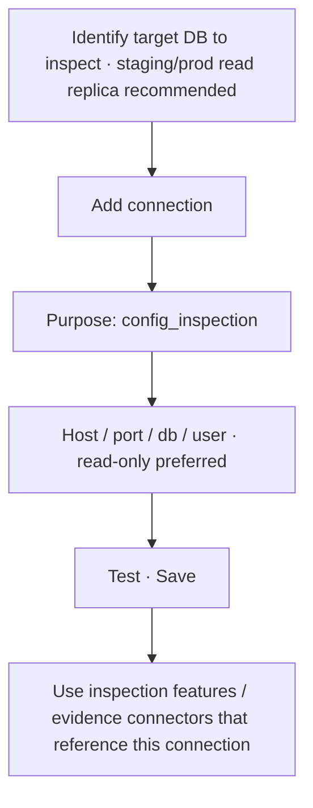

# Platform: Connect a config inspection database

**Where:** **Security Database** → `/connections`  
**Purpose:** Optional DB used for **configuration / posture inspection** (roles, privileges, policies) — not the main findings store.  
**Type:** `config_inspection`

---

## How this differs from security storage

| | Security data storage | Config inspection |
|--|----------------------|-------------------|
| Holds | Assets, findings, risks, SOC, tracker | Read-oriented config / privilege views |
| Bootstrap | Full Phantix security schema | Lighter / inspection-oriented |
| Required? | **Yes** for product modules | Optional |
| Writes | Org security data lives here | Prefer least-privilege read |

---

## Process flow

---

## Steps

1. Prefer a **read replica** or dedicated inspection account (SELECT-only where possible).
2. Platform → **Security Database**.
3. **Add connection** → purpose **Config inspection** (or equivalent label).
4. Enter connection details → **Test** → save.
5. Do **not** replace your primary security storage connection with this one.
6. Keep security storage as **primary** for Command Centre data.

---

## Safety

- Never use a high-privilege production admin user if a read-only role exists.
- Config inspection must not be confused with “put all security findings in prod DB” — findings stay in **security_data_storage**.

**Related:** [06-connect-security-database.md](./06-connect-security-database.md)
