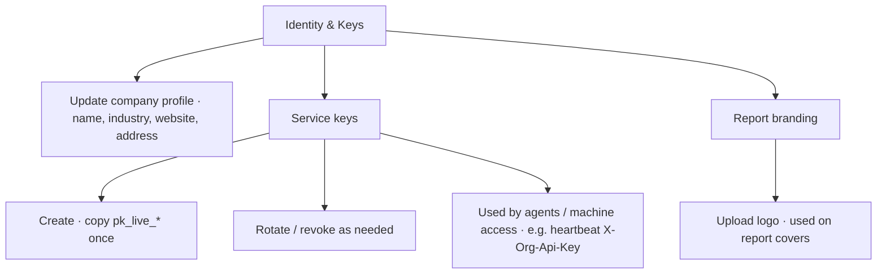

# Platform: Identity, service keys & report branding

**Where:** **Identity & Keys** → `/identity`

---

## Process flow

---

## Steps

### Company identity
1. Open **Identity & Keys**.
2. Edit legal/display fields → save (operate if required).

### Service key
1. **Create** service key.
2. Copy `pk_live_…` immediately (may not be shown again).
3. Store in a secret manager.
4. Use for SOC heartbeat agent / integrations — **never** paste a user JWT on servers.
5. **Rotate** if leaked; **revoke** old keys.

### Branding
1. Upload organization logo for PDF/PPTX report chrome.
2. Remove/replace when rebranding.

---

## Tips

- Service keys are org-scoped machine credentials.
- Command Centre user sessions use app dual tokens, not the service key.
