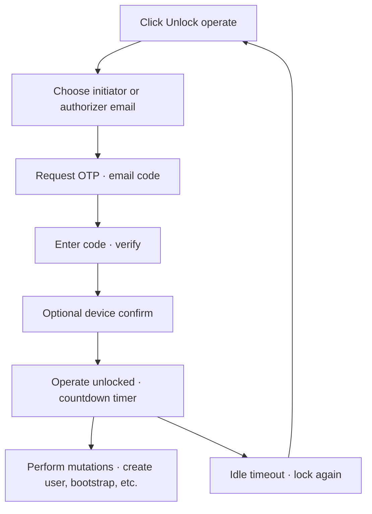

# Platform: Unlock operate (dual-control session)

**Where:** Header dual-control widget or any mutation that prompts for operate  
**Result:** Short-lived session attached as `X-Dual-Control-Session` on protected API calls

---

## Process flow

---

## Steps

1. Ensure dual-control is configured ([04-assign-dual-control.md](./04-assign-dual-control.md)).
2. Click **Unlock operate**.
3. Select your controller email (must be initiator or authorizer).
4. Request and enter OTP.
5. Confirm the green **Operating as …** state and timer.
6. Complete admin actions.
7. **Lock session** when finished (or let it idle out).

---

## Notes

- Reads rarely need operate; writes often do.
- Command Centre uses the same dual-control model for scans, tracker PATCH, report generate, etc.
