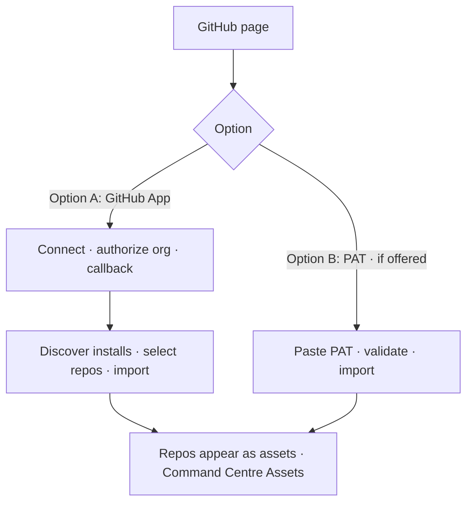

# Platform: Connect GitHub

**Where:** **GitHub** → `/github`  
**Why:** Import repos as assets / feed discovery into Command Centre

---

## Process flow

---

## Steps (GitHub App)

1. Platform → **GitHub**.
2. **Connect GitHub App** (operate if required).
3. Complete GitHub authorization in the popup/redirect.
4. Return to Platform; confirm **connected** status.
5. **Discover** installations / repos.
6. Select repositories → **Import**.
7. Open Command Centre **Assets** and verify imported repos.

---

## Tips

- Prefer GitHub App over long-lived PATs.
- Private repo features may require Premium entitlement.
- Re-run discover after adding the App to new GitHub orgs.
