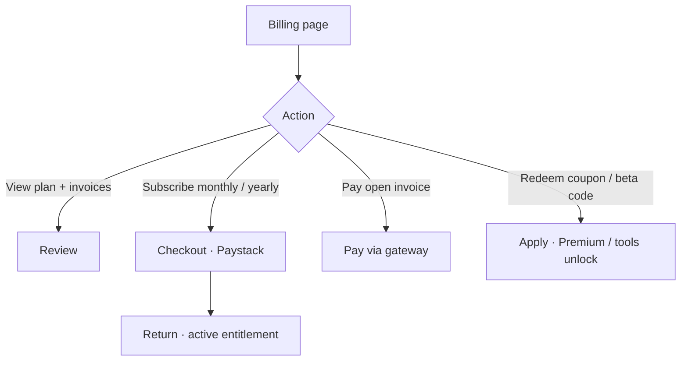

# Platform: Billing and subscribe

**Where:** **Billing** → `/billing`

---

## Process flow

---

## Steps

### Subscribe
1. Open **Billing**.
2. Choose monthly or yearly.
3. Complete payment checkout.
4. Confirm plan badge updates on the dashboard.

### Redeem coupon
1. Enter beta/coupon code.
2. Apply → Premium / tools unlock per coupon rules.

### Pay invoice
1. Open unpaid invoice.
2. Pay via gateway.
3. Confirm status **paid**.

---

## When you see HTTP 402

A Command Centre or Platform action needs a paid entitlement. Return here to upgrade, then retry the action.
