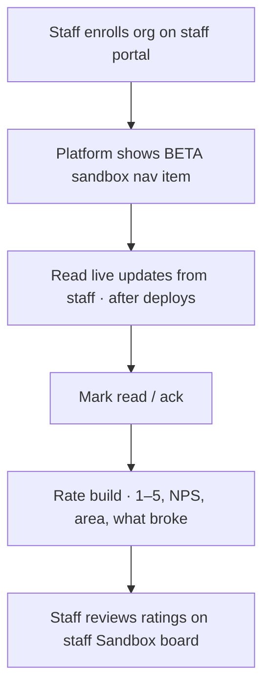

# Platform: BETA sandbox feedback

**Where:** **BETA sandbox** → `/sandbox` (only if org is enrolled)  
**Who:** Design-partner tenants (max 20)

---

## Process flow

---

## Steps

1. Confirm staff enrolled your `organization_id`.
2. Sign in to Platform → open **BETA sandbox**.
3. Read **Live updates**; ack each note after you refresh clients.
4. **Rate this build** for Platform or overall areas.
5. Use Command Centre `/sandbox` for product/SOC-focused ratings too.

---

## Not enrolled?

- Apply on https://phantixlabs.com (`#sandbox-apply`).
- Staff approve the application, then enroll the tenant.
- Until enrolled, the sandbox nav item stays hidden (API 404).
