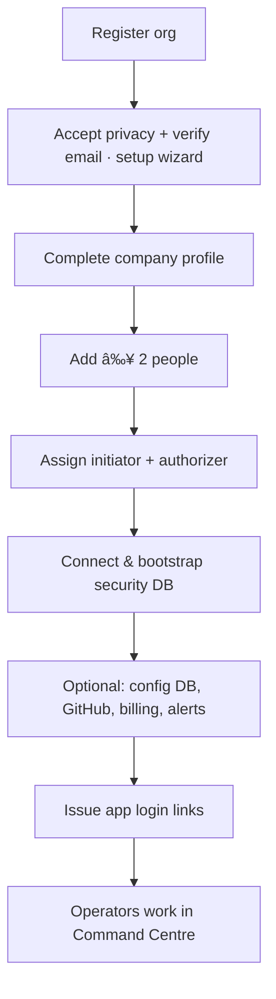

# Platform how-tos

**App:** https://platform.phantixlabs.com  
**Who:** Company / security admins  
**Does:** Tenant setup — identity, people, databases, billing. Not day-to-day scanning (that is Command Centre).

## Index

| # | Task | Doc |
|---|------|-----|
| 1 | Register & sign in | [01-register-and-sign-in.md](./01-register-and-sign-in.md) |
| 2 | Complete setup wizard | [02-complete-setup-wizard.md](./02-complete-setup-wizard.md) |
| 3 | Add a new user | [03-add-a-user.md](./03-add-a-user.md) |
| 4 | Assign dual-control (initiator / authorizer) | [04-assign-dual-control.md](./04-assign-dual-control.md) |
| 5 | Issue a Command Centre login link | [05-issue-app-login-link.md](./05-issue-app-login-link.md) |
| 6 | Connect **security** database | [06-connect-security-database.md](./06-connect-security-database.md) |
| 7 | Connect **config inspection** database | [07-connect-config-database.md](./07-connect-config-database.md) |
| 8 | Identity, service keys & branding | [08-identity-keys-branding.md](./08-identity-keys-branding.md) |
| 9 | Unlock operate (dual-control session) | [09-unlock-operate.md](./09-unlock-operate.md) |
| 10 | Connect GitHub | [10-connect-github.md](./10-connect-github.md) |
| 11 | Billing & subscribe | [11-billing-and-subscribe.md](./11-billing-and-subscribe.md) |
| 12 | Alert channels (email / WA / Telegram) | [12-configure-alerts.md](./12-configure-alerts.md) |
| 13 | BETA sandbox feedback | [13-sandbox-feedback.md](./13-sandbox-feedback.md) |

## End-to-end onboarding flow

Screenshots: `../../screenshots/platform/`
